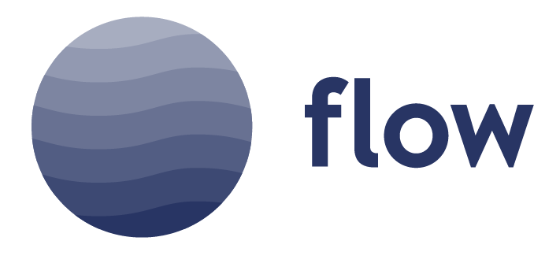

<p align="center">

</p>

[](https://travis-ci.org/iZettle/Flow)
[](https://img.shields.io/badge/platform-%20iOS%20|%20macOS%20|%20tvOS%20|%20linux-gray.svg)
[](https://github.com/Carthage/Carthage)
[](https://github.com/apple/swift-package-manager)

Modern applications often contain complex asynchronous flows and life cycles. Flow is a Swift library aiming to simplify building these by solving three main problems:

- **[Lifetime management](Documentation/LifetimeManagement.md)**: Managing long-living resources.
- **[Event handling](Documentation/Signals.md)**: Signaling and observing events over time.
- **[Asynchronous operations](Documentation/Futures.md)**: Handle results that might not yet be available.

Flow was carefully designed to be:

- **Easy to use**: APIs are carefully designed for readability and ease of use.
- **Pragmatic**: Evolved and designed to solve real problems.
- **Composable**: Types compose nicely making building complex flows easy.
- **Performant**: Flow has been highly tuned for performance.
- **Concurrent**: Flow is thread safe and uses a scheduler model that is easy to reason about.
- **Extensible**: Flow was designed to be extensible.
- **Strongly typed**: Flow makes use of Swift strong typing to better express intention.
- **Correct**: Backed by hundreds of unit tests and field tested for years.

## Example usage

In flow the `Disposable` protocol is used for lifetime management:

```swift
extension UIView {
  func showSpinnerOverlay() -> Disposable { 
    let spinner = ...
    addSubview(spinner)
    return Disposer {
      spinner.removeFromSuperview()
    }
  }
}

let disposable = view.showSpinnerOverlay()

disposable.dispose() // Hide spinner
```

And the `Signal<T>` type is used for event handling:

```swift
let bag = DisposeBag() // Bag of disposables

// UIButton provides a Signal<()>
let loginButton = UIButton(...)

bag += loginButton.onValue { 
  // Log in user if tapped
}

// UITextField provides a ReadSignal<String>
let emailField = UITextField(...)
let passwordField = UITextField(...)

// Combine and transform signals
let enableLogin = combineLatest(emailField, passwordField)
  .map { email, password in
    email.isValidEmail && password.isValidPassword
  } // -> ReadSignal<Bool>

// Use bindings and key-paths to update your UI on changes
bag += enableLogin.bindTo(loginButton, \.isEnabled)
```

And finally the `Future<T>` type handles asynchronous operations:

```swift
func login(email: String, password: String) -> Future<User> {
  let request = URLRequest(...)
  return URLSession.shared.data(for: request).map { data in
    User(data: data)
  }
}

login(...).onValue { user in
  // Handle successful login
}.onError { error in
  // Handle failed login
}
```

These three types come with many extensions that allow us to compose complex UI flows:

```swift
class LoginController: UIViewController {
  let emailField: UITextField
  let passwordField: UITextField
  let loginButton: UIButton 
  let cancelButton: UIBarButtonItem 
  
  var enableLogin: ReadSignal<Bool> { // Introduced above }
  func login() -> Future<User> { // Introduced above }
  func showSpinnerOverlay() -> Disposable { // Introduced above }
  
  // Returns future that completes with true if user chose to retry
  func showRetryAlert(for error: Error) -> Future<Bool> { ... }
  
  // Will setup UI observers and return a future completing after a successful login 
  func runLogin() -> Future<User> {
    return Future { completion in // Completion to call with the result  
      let bag = DisposeBag() // Resources to keep alive while executing 
         
      // Make sure to signal at once to set up initial enabled state
      bag += self.enableLogin.atOnce().bindTo(self.loginButton, \.isEnabled)  

      // If button is tapped, initiate potentially long running login request
      bag += self.loginButton.onValue {
        self.login()
          .performWhile { 
            // Show spinner during login request
            self.showSpinnerOverlay() 
          }.onErrorRepeat { error in
	          // If login fails with an error show an alert...
	          // ...and retry the login request if the user chose to
            self.showRetryAlert(for: error)
          }.onValue { user in
            // If login is successful, complete runLogin() with the user
            completion(.success(user))
          }
      }
      
      // If cancel is tapped, complete runLogin() with an error
      bag += self.cancelButton.onValue { 
        completion(.failure(LoginError.dismissed))
      }
      
      return bag // Return a disposable to dispose once the future completes
    }
  }
}
```

## Introductions

Introductions to the main areas of Flow can be found at:

- [Lifetime management](Documentation/LifetimeManagement.md)
- [Event handling](Documentation/Signals.md)
- [Asynchronous operations](Documentation/Futures.md)

To learn even more about available functionality you are encouraged to explore the source files that are extensively documented. Code-completion should also help you to discover many of the transformations available on signals and futures. 

## Requirements

- Xcode `9.3+`
- Swift 4.1
- Platforms:
  * iOS `9.0+`
  * macOS `10.11+`
  * tvOS `9.0+`
  * watchOS `2.0+`
  * Linux

## Installation

#### [Carthage](https://github.com/Carthage/Carthage)

```shell
github "iZettle/Flow" >= 1.0
```

#### [Cocoa Pods](https://github.com/CocoaPods/CocoaPods)

```ruby
platform :ios, '9.0'
use_frameworks!

target 'Your App Target' do
  pod 'FlowFramework', '~> 1.0'
end
```

#### [Swift Package Manager](https://github.com/apple/swift-package-manager)

```swift
import PackageDescription

let package = Package(
  name: "Your Package Name",
  dependencies: [
      .Package(url: "https://github.com/iZettle/Flow.git",
               majorVersion: 1)
  ]
)
```

## Field tested

Flow was developed, evolved and field-tested over the course of several years, and is pervasively used in [iZettle](https://izettle.com)'s highly acclaimed point of sales app.
